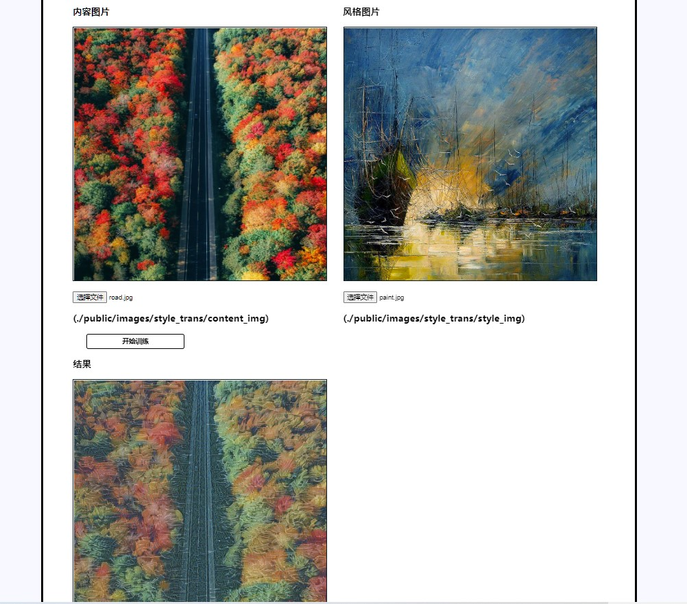
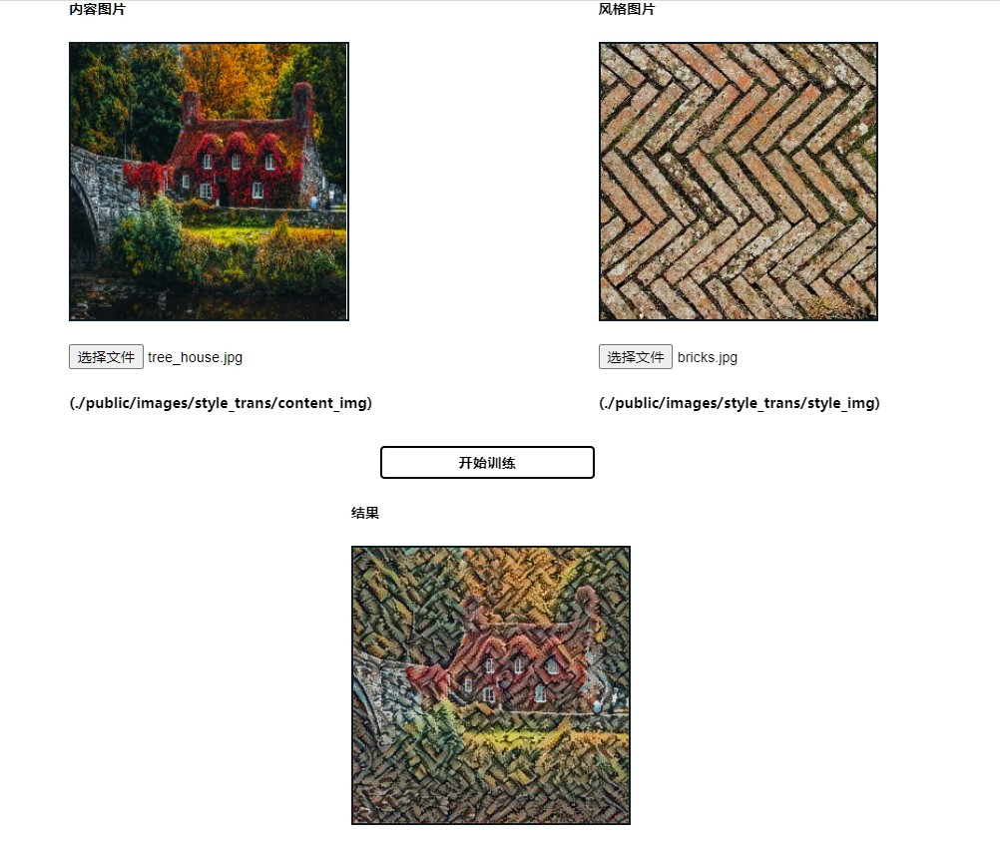
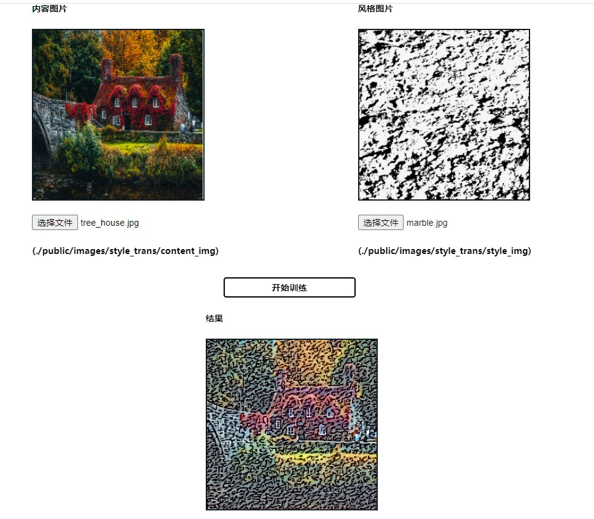
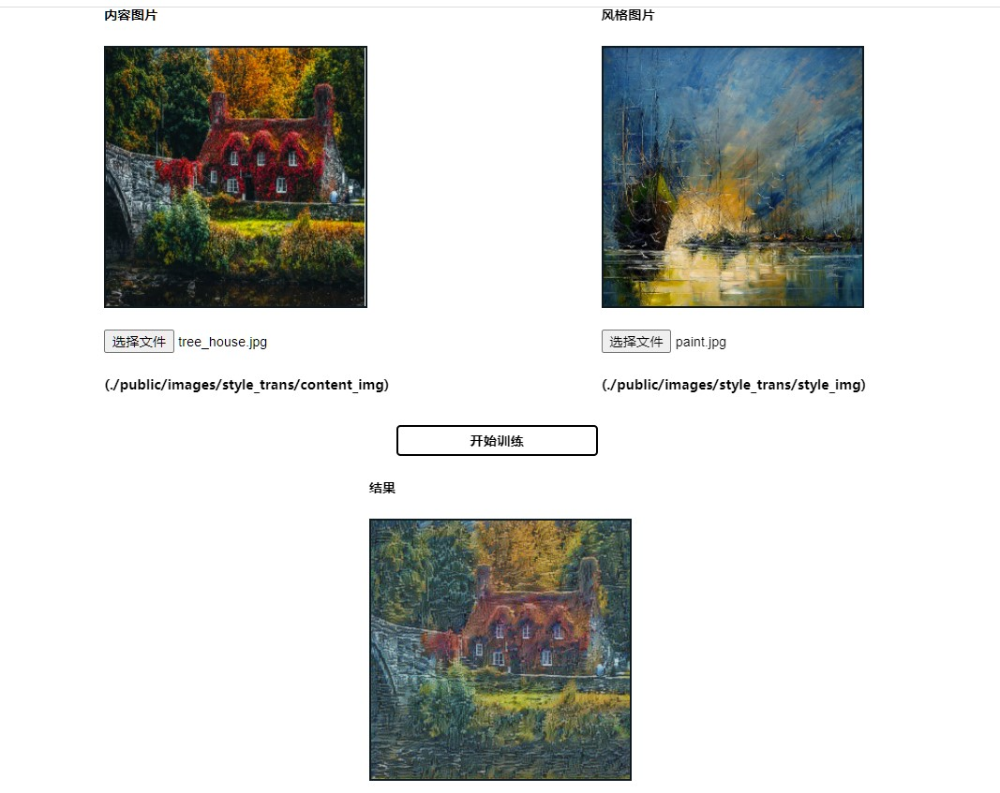
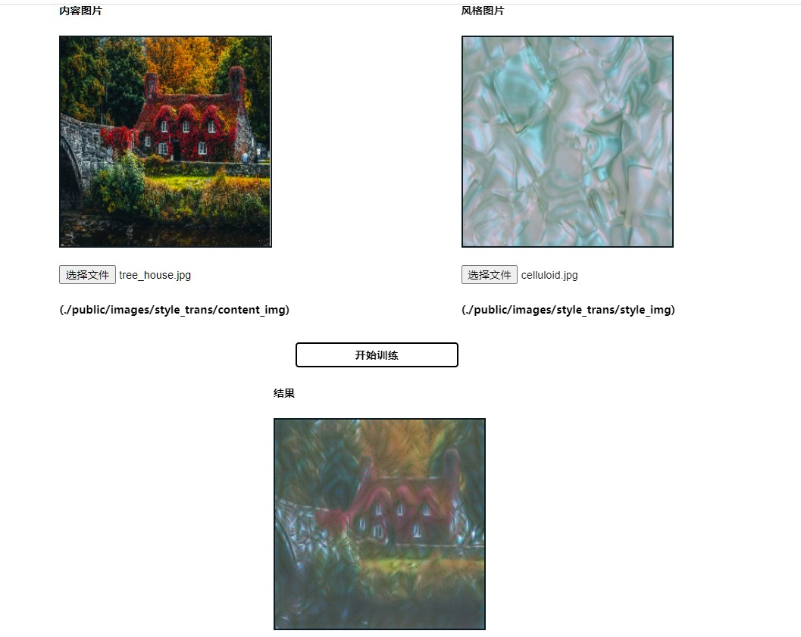

## 文件结构

```
—— .assets                      内为本文档中使用的图片
 |—— bin                        内有启动节点
 |—— public
        |—— images             网页内使用到的图片
            |—— style_trans    风格迁移所使用的图片 
                |—— content_img 提供内容的图片 
                |—— style_img   提供风格的图片
        |—— javascripts        js文件
        |—— stylesheets        css文件
 |—— routes                    路由初始化
 |—— tfjs                       内有预训练完成的VGG16模型
 |——util  
        |—— jwt.js          jwt接口封装
        |—— scrypt.js       scrypt加密/解密接口封装
        |—— utils.js        api有关路由的实现
        |—— img_control.js  风格迁移的实现
 |—— view                   页面html
        |—— detail_picture_page 二级页面
        |—— error.html      
        |—— login.html      登录页面
        |—— mainpage.html   一级页面
        |—— register.html   注册页面
        |—— style_transfer.html  风格迁移页面
 |—— app.js                 注册express中间件，路由配置等
 |—— readme.md              本文件
```

## 1. 前端智能——图像风格迁移

#### 如何运行

1. 下载依赖
   
   ```shell
    npm install
   ```

2. 执行如下sql语句，建立本地数据库（可选）
   
   ```mysql
   CREATE schema `user_info`;
   CREATE table `user_info`(
    `name` varchar(256) not null primary key,
    `email` varchar(256) not null,
    `password` varchar(256) not null
   );
   ```

3. 修改util/util.js中const db中的user和password，同时确保本地mysql使用的是mysql_native_password登录模式（可选）

4. 启动本express项目
   
   ```shell
    npm start
   ```

5. 
- 选项一：访问完整项目。mysql占用端口3306, express占用端口3000.使用浏览器访问[127.0.0.1:3000](http://127.0.0.1:3000)，即可访问本项目。<br>（登录-主页-点击"风格迁移"按钮-风格迁移界面）
- 选项二：若仅希望访问风格迁移页面，可以无需构建数据库，直接使用浏览器访问[127.0.0.1:3000/style_transfer.html](http://127.0.0.1:3000/style_transfer.html)

#### 实现功能展示











#### 实现方式

- 使用官方提供的预训练vgg16模型用来提取风格特征和内容特征
- 使用tensorflow.js库进行训练
  
  ##### 实现方式————流程
1. 前端页面：点击开始训练，在express框架下，会向nodejs后端发送请求。

2. 读入图片：读取请求中的图片路径。

3. 对图片做预处理：
   
   - 考虑到计算速度，进行缩放，大小由前端传入的size参数决定
   - 预处理，即减去平均值

4. 加载模型：后端加载vgg16模型（主要是提供参数）

5. 构建风格迁移的模型：实现按照vgg的计算方法，即block1conv1-relu-block1conv2-relu-block1_pool···的顺序进行计算的函数，使用vgg16的参数。
   
   ```js
    function conv_and_relu(input, w_b) {
        return tf.tidy(() => {
            let conv = tf.conv2d(input, w_b.kernel, [1, 1], 'same');
            return tf.relu(tf.add(conv, w_b.bias));
        })
    }
   
    function max_pool(input) {
        return tf.maxPool(input, [2, 2], [2, 2], 'same');
    }
   ```

6. 生成输入（同时也是待优化的参数）img：在内容图片的基础上加入噪声。

7. 生成目标 target：即提取 内容图片的内容特征 和 风格图片的风格特征

8. 实现损失函数：
   
   - 对于风格损失，是target和img的风格特征矩阵的gram矩阵的距离
   - 对于内容损失，是target和img的内容特征矩阵的距离
   - 将两者相加

9. 训练：使用tensorflow.js提供的Adam梯度优化器，在损失函数上对img进行优化。

10. 最后将训练完成的img传递给前端，并将其画在画布上。
    
    ##### 实现方式———一些设置

11. 选择的卷积层：根据随作业提供的参考文献、并考虑计算速度选择
    
    ```js
    const layer_config = {
     'content': {
         data: ['block1_conv1'],
         num: 1
     },
     'style': {
         data: ['block1_conv1', 'block2_conv1', 'block3_conv1'],
         num: 3
     }
    }
    ```

12. 为损失函数选择的加权系数
    
    ```js
    const weight_config = {
     style_weight: [0.3, 0.3, 0.3],
     content_weight: [1000],
    }
    ```
    
    style_weight 数组代表每一层提取的风格特征矩阵计算结果的加权系数，在观察风格损失和内容损失的值时，如上系数能使两者数量级相近（与具体的图像有关）

## 2：实现水印

##### 注意：频域水印中，直接打开html会造成 ctx.getImageData的跨域错误。

     可以：

        1.通过webstorm打开

        2.安装http-server插件（比如vs的插件）

        3.wm_result文件夹中有效果网页的截图

### 水印展示

- svg水印：请打开detail_picture_page/detail_picture_1.html
  
  - 网页截图如下：
  - 

- 频域水印：请打开detail_picture_page/detail_picture_2.html
  
  - 效果如下
  
  
  
  - 加水印后图如下：
    
    - 

### 实现方式

- svg水印
  
  - 将svg标签写入html文件中。
  - js中获取svg下text标签，修改水印内容（本页面设置为201250206）
  - 将svg中的内容编码为base64，获得字符串，并移除svg元素
  - 使用js将base64字符串设置为页面背景url

- 频域水印
  
  - js内主要内容如下
  
  - ```js
    //实现复数类:
    class Complex{}
    
    //主要流程：
    function read_img_to_fd(){} //1.读入原图并进行傅里叶变换
    function get_watermark(){} // 2.读入水印
    function add_wm(){} //3.在频域图像上添加水印
    function draw_wmed(fft_wmed_blue){}// 4.经过逆傅里叶变换获得最终图像并画在指定canvas上
    function draw_complex(complex_blue, id){}//5.接受在复数域内的rgb矩阵，处理后画出频域图像
    
    // 实现快速傅里叶变换/逆傅里叶变换算法：
    function fft(array){}
    function ifft(complex_array){}
    function fft_recursion(complex_array, minus){}
    ```
  
  - 具体细节说明
    
    - 考虑到处理效率的问题：
      - 截取原图左上512x512大小的部分添加水印，因此展示的频域图像大小均为512x512
      - 在rgb三通道中仅选择b通道进行处理，其余两通道没有改变
    - 为展示处理过后加水印图片的原貌，仅做了简单的css样式处理
    - 快速傅里叶变换是蝶形算法实现的

## 3: 主题切换

#### 实现方式

- 1.在根作用域下定义css变量, 在不同类名下定义不同主题的样式。(style.css)
  
  ```css
  :root{
      --text-color: black;
      ...
  }
  .dark{        /*深色模式*/
      --text-color: white;
      ...
  }
  .light{       /*浅色模式*/
      --text-color: black;
      ...
  }
  #bar{         /* 使用变量作为值 */
    color: var(--text-color);
  }
  ...
  ```

- 2.实现切换body类名的函数(style.js), 当类名与对应主题的类名一致时，会将body下元素改用对应主题。
  
  ```js
  function change(theme){
    document.body.className=theme;
  }
  ```

- 3.实现切换模式的按钮，切换类名的函数就绑定在这两个按钮上(mainpage.html)
  
  ```html
  <div class="style-change-button">
    <button class="icon" id="light-icon" onclick="change('light')">
        
    </button>
    <button class="icon" id="dark-icon" onclick="change('dark')">
        
    </button>
  </div>
  ```

- 4.本项目的按钮样式定义在button.css中，考虑到按钮主题应该与页面主题符合，button.css中也做了1中处理。

- 5.与格式有关的样式(比如width,display……)仍留存在mainpage.css中,style.css中只保留颜色样式。

## 4: 登录与注册、前端鉴权

#### 如何运行

1. 下载依赖
   
   ```shell
   npm install
   ```

2. 执行如下sql语句，建立本地数据库
   
   ```mysql
   CREATE schema `user_info`;
   CREATE table `user_info`(
   `name` varchar(256) not null primary key,
   `email` varchar(256) not null,
   `password` varchar(256) not null
   );
   ```

3. 修改util/util.js中const db中的user和password，同时确保本地mysql使用的是mysql_native_password登录模式

4. 启动本express项目
   
   ```shell
   npm start
   ```

5. mysql占用端口3306, express占用端口3000.使用浏览器访问[127.0.0.1:3000](http://127.0.0.1:3000)，即可以访问本项目。
   
   #### 实现功能展示

6. 注册页面
- 账号仅支持邮箱；

- 密码可以通过点击眼睛图标设置可见/不可见；

- 密码后有提示文字，包括 空 短 弱 中 强 长 六种；

- 验证码可以点击刷新按钮更换

- 点击立即登录跳转到登陆界面

- 注册过程中的错误提示包括：
  
  - 邮箱为空
  - 邮箱格式错误
  - 邮箱已被注册
  - 用户名为空
  - 用户名重复
  - 用户名内有非法字符
  - 用户名过长
  - 密码为空
  - 密码过短或过长
  - 密码内含有非法字符
  - 验证码为空
  - 验证码错误
2. 登录页面
- 可以使用注册时使用的用户名或邮箱登录

- 密码不可见

- 验证码有关与注册界面的功能相同

- 点击立即注册可以跳转至注册界面

- 错误提示包括
  
  - 账号未注册
  - 账号为空
  - 密码输入错误
  - 密码为空
  - 验证码错误
  - 验证码为空
3. 一级页面
- 未登录时：点击登录可以跳转登录界面

- 登陆后：展示用户名
4. 二级页面
- 登陆后在左上角展示用户信息，若未登录则仅有图片展示

- 仅实现了两个二级页面detail_page_1.html和detail_page_2.html，是一级页面第一列的第一个图片和第二个图片。
  
  #### 实现方式
1. 用户密码的加密方式采用SCrypt算法，使用了nodejs内置的crypto包。
   - util/scrypt.js中对其加密解密进行了封装.
   - 在util/utils.js的登录时调用，将从数据库查找出的密文进行解密；注册中将传来的明文密码进行加密并存储。
2. 验证码
   - 生成使用svg-captcha包，同时将验证码的实际内容的字符串添加入cookies。见util/utils.js内的验证码生成函数
   - 验证时将用户输入的字符串与cookie中携带的正确字符进行比较
3. 鉴权方式：jwt
   - jwt加密：使用jsonwebtoken包.
     - 在util/jwt.js中进行封装;
     - 在util/utils.js的登录过程中调用，将加密的token作为登录的返回数据。
   - 将加密的token储存在localStorage中
   - jwt验证：使用express-jwt中间件，见app.js
     - 访问使用中间件的路由时，在请求头中加上jwt加密的token
     - 中间件会解析加密token并将解密后的内容插入req.auth，由此获得登录用户信息。
